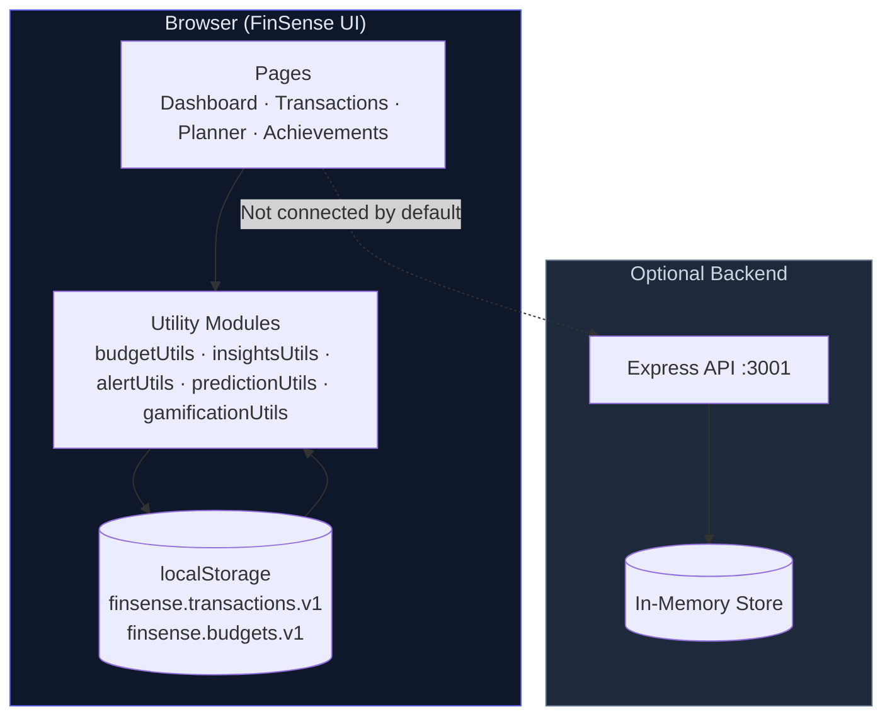
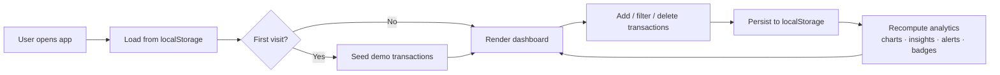

<p align="center">
  
</p>

<div align="center">

# 🚀 FinSense

### *AI-Powered Student Budget Assistant*

**Track spending, plan smarter budgets, and build better money habits — all in a beautiful, mobile-inspired dashboard.**

FinSense is a modern student finance app built on the original **budget.track** project. It adds analytics, charts, predictive budgeting, rule-based insights, gamification, and a multi-page React experience — while keeping your data **private and local** in the browser via `localStorage`.

<br />

[](https://react.dev/)
[](https://tailwindcss.com/)
[](https://www.chartjs.org/)
[](https://expressjs.com/)
[](https://nodejs.org/)

[](https://github.com/Ramya-Ramadoss/student-budget-tracker-reforge)
[](./package.json)
[](#-license)
[](https://github.com/Ramya-Ramadoss/student-budget-tracker-reforge/commits/main)
[](https://github.com/Ramya-Ramadoss/student-budget-tracker-reforge/issues)
[](https://github.com/Ramya-Ramadoss/student-budget-tracker-reforge/stargazers)
[](https://github.com/Ramya-Ramadoss/student-budget-tracker-reforge/network/members)

<br />

| 🌐 **Live Demo** | 📖 **Documentation** | 🎥 **Demo Video** | 📦 **Repository** |
|:---:|:---:|:---:|:---:|
| [Add Deployment Link Here](https://your-live-demo-link.com) | [Add Docs Link Here](https://your-docs-link.com) | [Add YouTube Link Here](https://youtube.com/...) | [**student-budget-tracker-reforge**](https://github.com/Ramya-Ramadoss/student-budget-tracker-reforge) |

<br />


> *Replace this with your project banner or hero image.*

</div>

---

## 📑 Table of Contents

- [Project Overview](#-project-overview)
- [Features](#-features)
- [Tech Stack](#-tech-stack)
- [Project Architecture](#-project-architecture)
- [Screenshots](#-screenshots)
- [Live Demo](#-live-demo)
- [Installation](#-installation)
- [Usage](#-usage)
- [Folder Structure](#-folder-structure)
- [Configuration](#-configuration)
- [API Documentation](#-api-documentation)
- [AI & Predictive Analytics](#-ai--predictive-analytics)
- [Performance](#-performance)
- [Security](#-security)
- [Roadmap](#-roadmap)
- [Future Enhancements](#-future-enhancements)
- [Contributing](#-contributing)
- [License](#-license)
- [Author](#-author)
- [Acknowledgements](#-acknowledgements)
- [Support](#-support)

---

## 📖 Project Overview

### What is FinSense?

**FinSense** is a student-focused budget and expense tracker that helps you understand where your money goes, stay within limits, and build consistent saving habits. It combines a polished dark-mode UI with practical analytics — without requiring sign-up, servers, or a database for day-to-day use.

### The Problem It Solves

Students often juggle limited income, irregular expenses, and no structured way to visualize spending. Spreadsheets are tedious; generic finance apps are overwhelming. FinSense offers a **lightweight, visual, and motivating** alternative tailored to student life.

### Why It Was Built

FinSense extends the original **budget.track** single-page tracker into a full **FinSense dashboard experience** while preserving backward compatibility via the `/classic` route. The goal is to deliver:

- Clear category-based expense tracking
- Behavioral insights from your own data
- Early warnings before overspending
- Gamification to encourage consistency

### Key Objectives

| Objective | How FinSense Delivers |
|-----------|----------------------|
| Track income & expenses | Transactions page + modal with categories, notes, and dates |
| Visualize spending | Pie, bar, and line charts powered by Chart.js |
| Plan budgets | Monthly, weekly, and per-category limits with progress bars |
| Stay accountable | Budget alerts, predictive projections, and achievement badges |
| Work offline | All FinSense UI data persists in browser `localStorage` |

### Who Can Use It

- 🎓 **Students** managing stipends, part-time income, and daily expenses
- 👨‍💻 **Developers** looking for a clean React + Tailwind + Chart.js reference project
- 🏫 **Hackathon teams** needing a finance dashboard starter with analytics built in

---

## ✨ Features

### Core Features

| Feature | Description |
|---------|-------------|
| 💰 **Income & Expense Tracking** | Log transactions with amount, category, date, and optional notes |
| 📊 **Dashboard Analytics** | Balance, income, expenses, and savings at a glance |
| 🗂 **Category System** | Food, Transport, Shopping, Entertainment, Study, and Income |
| 🧾 **Transaction Timeline** | Date-grouped list with type, category, and date-range filters |
| 🎛 **Budget Planner** | Set monthly, weekly, and per-category spending limits |
| 🔄 **Classic Tracker** | Original single-page workflow at `/classic`, synced via shared storage |

### AI Features

> ⚠️ **Note:** FinSense uses **rule-based, client-side analytics** — not external LLMs or ML models. Insights are generated locally from your transaction patterns.

| Feature | Description |
|---------|-------------|
| 🧠 **AI Insights Panel** | Detects top spending categories, 40%+ category concentration, weekend vs weekday patterns |
| 🔮 **Predictive Budgeting** | Projects monthly expenses from current pace: `(expenses × 30) / daysPassed` |
| ⚠ **Smart Budget Alerts** | Daily overspend, weekly 85%+ usage, and category limit warnings (90%+) |

### UI/UX Features

| Feature | Description |
|---------|-------------|
| 🌙 **Dark Premium Theme** | Slate-based palette with violet/cyan accents and glassmorphism cards |
| 📱 **Mobile-Inspired Layout** | Bottom-sheet modal on mobile; responsive grid navigation |
| 🎨 **Category Colors & Emojis** | Consistent visual identity across lists, chips, and charts |
| 🧭 **Tab Navigation** | Sticky header with Dashboard, Transactions, Planner, and Achievements |
| 💳 **Live Balance Header** | Real-time balance display in the app bar |

### Security Features

| Feature | Description |
|---------|-------------|
| 🔒 **Local-First Data** | FinSense UI stores data in browser `localStorage` — no cloud sync by default |
| ✅ **Input Validation** | Amount validation in the expense modal (positive numbers required) |
| 🚫 **No Auth Required** | Zero credentials needed for the client-side experience |

### Performance Features

| Feature | Description |
|---------|-------------|
| ⚡ **Client-Side Computation** | Analytics computed with `useMemo` — no network round-trips |
| 📦 **Lightweight Stack** | No heavy state management library; React hooks + utility modules |
| 🌱 **Seed Data** | Demo transactions auto-seeded on first load for instant exploration |

### Developer Features

| Feature | Description |
|---------|-------------|
| 🛠 **Monorepo Scripts** | Run client + server concurrently with one command |
| 📁 **Modular Utils** | Separate modules for budget, alerts, insights, predictions, and gamification |
| 🔌 **Optional Express API** | Original REST API preserved for future backend integration |
| 🎯 **CRA + Tailwind** | Standard Create React App with PostCSS and TailwindCSS |

---

## 🧰 Tech Stack

| Layer | Technology |
|-------|------------|
| **Frontend** | React 18, React Router DOM 7, Create React App |
| **Backend** | Node.js 18+, Express 4 |
| **Database** | Browser `localStorage` (FinSense UI); in-memory array (Express API) |
| **AI/ML Frameworks** | *None — rule-based client-side logic* |
| **Libraries** | Chart.js 4, react-chartjs-2, uuid, cors, concurrently |
| **APIs** | REST (`/api/entries`) — optional; not used by FinSense UI |
| **Authentication** | *Not implemented* |
| **Cloud/Hosting** | *Placeholder — deploy to Vercel, Netlify, Render, etc.* |
| **Deployment** | `npm run build` (client) + `node server/index.js` (API) |
| **Dev Tools** | TailwindCSS 3, PostCSS, Autoprefixer, npm scripts |

---

## 🏗 Project Architecture

### Folder Structure Overview

```
student-budget-tracker/
├── client/          → React frontend (FinSense UI)
├── server/          → Express REST API (original project)
├── package.json     → Root scripts (dev, install:all)
└── README.md
```

### Data Flow



### Application Workflow



### Routing

| Route | Page | Purpose |
|-------|------|---------|
| `/` | Dashboard | Analytics hub with charts, predictions, insights |
| `/transactions` | Transactions | Timeline, filters, add expense/income |
| `/budget-planner` | Budget Planner | Configure and track budget limits |
| `/achievements` | Achievements | Streaks, badges, financial health score |
| `/classic` | Legacy Tracker | Original single-page tracker experience |

<details>
<summary><strong>📂 Detailed client architecture</strong></summary>

<br />

| Directory | Responsibility |
|-----------|----------------|
| `client/src/pages/` | Route-level page components |
| `client/src/components/` | Reusable UI (cards, modals, panels) |
| `client/src/charts/` | Chart.js wrappers (Pie, Bar, Line) |
| `client/src/utils/` | Business logic and localStorage access |
| `client/src/data/` | Category definitions (emoji, color, id) |

</details>

---

## 📸 Screenshots

> Add your screenshots here. Recommended path: `docs/screenshots/`

### Dashboard


*Balance cards, predictive budgeting banner, category pie chart, weekly bar chart, monthly line chart, AI insights, budget alerts, and gamification panel.*

### Transactions


*Date-grouped timeline with type, category, and date-range filters plus the add-transaction modal.*

### Budget Planner


*Monthly and weekly limits with per-category progress bars.*

### Achievements


*Saving streak, financial health score, and unlockable badges.*

### Classic Tracker


*Original add/delete workflow preserved at `/classic`.*

### Predictive Budgeting


*Monthly expense projection and on-track / exceed warnings.*

---

## 🌐 Live Demo

| Resource | Link |
|----------|------|
| 🌐 **Live Demo** | **[Add Deployment Link Here]** |
| 🎥 **Demo Video** | **[Add YouTube Link Here]** |
| 📄 **Documentation** | **[Add Docs Link Here]** |

> 💡 **Quick local preview:** After installation, open [http://localhost:3000](http://localhost:3000)

---

## ⚙️ Installation

### Prerequisites

- **Node.js** `>= 18.0.0`
- **npm** (comes with Node.js)

### 1. Clone the Repository

```bash
git clone https://github.com/Ramya-Ramadoss/student-budget-tracker-reforge.git
cd student-budget-tracker-reforge
```

### 2. Install Dependencies

```bash
# Install root + client dependencies
npm run install:all
```

<details>
<summary><strong>Manual install (alternative)</strong></summary>

```bash
npm install
cd client && npm install
```

</details>

### 3. Environment Setup

No environment variables are required for local development. The Express server accepts an optional `PORT`:

```bash
# Optional — defaults to 3001
PORT=3001
```

### 4. Run Locally

**Full stack (API + React app):**

```bash
npm run dev
```

| Service | URL |
|---------|-----|
| React app (FinSense UI) | [http://localhost:3000](http://localhost:3000) |
| Express API | [http://localhost:3001](http://localhost:3001) |

**Frontend only:**

```bash
cd client
npm start
```

**Backend only:**

```bash
npm run server
```

### 5. Production Build

```bash
cd client
npm run build
```

Serve the `client/build/` folder with any static host (Netlify, Vercel, Nginx, etc.). Run the Express API separately if needed.

<details>
<summary><strong>🚀 Deployment notes</strong></summary>

<br />

| Target | Frontend | Backend |
|--------|----------|---------|
| **Vercel / Netlify** | Deploy `client/build` | Not required for FinSense UI |
| **Render / Railway** | Static site or CRA build | Deploy `server/index.js` |
| **Docker** | *Not yet configured — see Roadmap* | — |

</details>

---

## 🎯 Usage

### Step 1 — Explore the Dashboard

Open the app and review the **Dashboard** (`/`). On first load, demo transactions are seeded automatically so charts and insights populate immediately.

### Step 2 — Add Transactions

1. Navigate to **Transactions** (`/transactions`)
2. Click **+ Add Expense** (or add income via the modal toggle)
3. Enter amount, date, category, and optional note
4. Save — data persists to `localStorage` instantly

### Step 3 — Set Budget Limits

1. Go to **Budget Planner** (`/budget-planner`)
2. Set **monthly** and **weekly** limits
3. Configure **per-category caps** (Food, Transport, etc.)
4. Click **Save Budgets** and watch progress bars update

### Step 4 — Monitor Alerts & Predictions

Return to the **Dashboard** to see:

- 🔮 **Predicted monthly expense** based on your current spending pace
- ⚠ **Budget alerts** when daily, weekly, or category limits are approached
- 🧠 **AI insights** about spending patterns

### Step 5 — Earn Achievements

Visit **Achievements** (`/achievements`) to track:

- 🔥 **Saving streak** — consecutive days under your daily budget
- 📈 **Financial health score** — savings as a percentage of income
- 🏅 **Badges** — Budget Master, Smart Saver, Expense Tracker

### Example Workflow

```
Receive stipend → Add as Income → Log daily expenses →
Set monthly budget → Check dashboard alerts →
Adjust category limits → Maintain saving streak 🎯
```

<details>
<summary><strong>🕹 Classic Tracker mode</strong></summary>

<br />

Visit **`/classic`** for the original single-page tracker. It uses the **same localStorage data**, so entries sync with the FinSense dashboard automatically.

</details>

---

## 📁 Folder Structure

```
student-budget-tracker/
├── .gitignore
├── package.json                 # Root scripts & server dependencies
├── package-lock.json
├── README.md
│
├── server/
│   └── index.js                 # Express REST API (in-memory store)
│
└── client/
    ├── package.json             # React app dependencies
    ├── package-lock.json
    ├── postcss.config.js        # Tailwind + Autoprefixer
    ├── tailwind.config.js       # Theme extensions (fonts, shadows)
    │
    ├── public/
    │   └── index.html           # CRA HTML shell
    │
    └── src/
        ├── App.jsx              # Router, layout, global state
        ├── index.js               # React entry point
        ├── index.css              # Tailwind directives
        │
        ├── pages/
        │   ├── Dashboard.jsx      # Analytics hub
        │   ├── Transactions.jsx   # Timeline + filters
        │   ├── BudgetPlanner.jsx  # Budget limits & progress
        │   ├── Achievements.jsx   # Gamification page
        │   └── LegacyTracker.jsx  # Classic tracker (/classic)
        │
        ├── components/
        │   ├── AIInsights.jsx
        │   ├── BalanceCard.jsx
        │   ├── BudgetAlert.jsx
        │   ├── ExpenseModal.jsx
        │   ├── GamificationPanel.jsx
        │   └── TransactionItem.jsx
        │
        ├── charts/
        │   ├── chartSetup.js      # Chart.js registration
        │   ├── PieChart.jsx       # Category distribution
        │   ├── WeeklyBarChart.jsx # Daily weekly spend
        │   └── MonthlyLineChart.jsx # Cumulative monthly trend
        │
        ├── utils/
        │   ├── storage.js         # localStorage CRUD + seed data
        │   ├── budgetUtils.js     # Totals, grouping, trends
        │   ├── predictionUtils.js # Monthly expense projection
        │   ├── insightsUtils.js   # Rule-based insights
        │   ├── alertUtils.js      # Budget warning logic
        │   └── gamificationUtils.js # Streaks, badges, health score
        │
        └── data/
            └── categories.js      # Category emoji, color, id map
```

---

## 🔧 Configuration

### Environment Variables

| Variable | Required | Default | Description |
|----------|----------|---------|-------------|
| `PORT` | No | `3001` | Express API server port |

> FinSense UI does **not** require API keys, database URLs, or `.env` files.

### localStorage Keys

| Key | Contents |
|-----|----------|
| `finsense.transactions.v1` | Array of income/expense transactions |
| `finsense.budgets.v1` | Monthly, weekly, and category budget limits |

### Default Budget Values

When no budgets are saved, these defaults apply:

| Setting | Default (₹) |
|---------|-------------|
| Monthly limit | 8,000 |
| Weekly limit | 2,000 |
| Food | 2,000 |
| Transport | 800 |
| Shopping | 1,500 |
| Entertainment | 1,200 |
| Study | 1,000 |

### Configuration Files

| File | Purpose |
|------|---------|
| `client/tailwind.config.js` | Tailwind content paths, fonts, shadows |
| `client/postcss.config.js` | PostCSS plugin pipeline |
| `client/package.json` | Dev proxy → `http://localhost:3001` |

---

## 📡 API Documentation

> The Express API is from the **original budget.track project**. The FinSense UI operates on `localStorage` and does **not** call these endpoints by default.

**Base URL:** `http://localhost:3001`

| Endpoint | Method | Description | Parameters | Response |
|----------|--------|-------------|------------|----------|
| `/api/entries` | `GET` | List all entries | — | `Entry[]` |
| `/api/entries` | `POST` | Create an entry | Body: `label`, `amount`, `category`, `type`, `date` | `Entry` (201) |
| `/api/entries/:id` | `DELETE` | Remove an entry | Path: `id` | `{ ok: true }` |

<details>
<summary><strong>Request / response examples</strong></summary>

<br />

**POST `/api/entries`**

```json
{
  "label": "Coffee",
  "amount": 120,
  "category": "food",
  "type": "expense",
  "date": "2026-03-01"
}
```

**Response (201):**

```json
{
  "id": "uuid-here",
  "label": "Coffee",
  "amount": 120,
  "category": "food",
  "type": "expense",
  "date": "2026-03-01"
}
```

**Error (400):** `{ "error": "All fields required" }`

</details>

---

## 🧠 AI & Predictive Analytics

FinSense does **not** use external AI models. All intelligence runs **client-side** through deterministic rules.

### Insights Engine (`insightsUtils.js`)

| Rule | Trigger |
|------|---------|
| Top category | Identifies highest-spending category |
| Concentration alert | Any category exceeds 40% of total expenses |
| Weekend pattern | Weekend spending > weekday spending |
| Peak day | Reports highest single-day spend |
| Income proximity | Expenses exceed 90% of income |

### Predictive Budgeting (`predictionUtils.js`)

```
predictedMonthlyExpense = (currentExpenseTotal × 30) / daysPassedInMonth
```

Compared against `monthlyLimit` to show on-track or exceed warnings.

### Gamification Logic (`gamificationUtils.js`)

| Metric | Formula / Rule |
|--------|----------------|
| **Health Score** | `(savings / income) × 100` |
| **Saving Streak** | Consecutive days (up to 30) where daily spend ≤ daily budget |
| **Badges** | Expense Tracker (10+ expenses), Smart Saver (20%+ savings rate), Budget Master (under monthly limit) |

<details>
<summary><strong>🔮 Future AI improvements</strong></summary>

<br />

- Integrate LLM APIs for natural-language spending summaries
- Train classification models for automatic category detection from notes
- Personalized savings recommendations based on historical patterns

</details>

---

## ⚡ Performance

| Technique | Implementation |
|-----------|----------------|
| **Memoized analytics** | `useMemo` in Dashboard and App for totals, charts, and gamification |
| **No network dependency** | FinSense UI works fully offline after first load |
| **Lightweight bundle** | No Redux, no heavy UI frameworks — React + Tailwind only |
| **Chart optimization** | Monthly line chart uses cumulative aggregation; point radius set to 0 |
| **Seed on first visit** | Instant demo experience without manual data entry |

### Scalability Notes

- Current design targets **single-user, browser-local** usage
- For multi-user or cross-device sync, connect the Express API to a persistent database (SQLite, PostgreSQL, MongoDB)

---

## 🔐 Security

| Area | Status |
|------|--------|
| **Authentication** | Not implemented — single-user local app |
| **Authorization** | N/A |
| **Input validation** | Amount must be a positive number in ExpenseModal |
| **Data storage** | Browser `localStorage` (not encrypted) |
| **CORS** | Enabled on Express API for development |
| **Secrets** | No API keys or credentials in the codebase |

> ⚠️ **Important:** Do not store sensitive financial credentials in this app. Data in `localStorage` is accessible to anyone with access to the browser profile.

---

## 🗺 Roadmap

- [x] Multi-page React dashboard with routing
- [x] Transaction tracking with categories and notes
- [x] Chart.js visualizations (pie, bar, line)
- [x] Budget planner with progress bars
- [x] Rule-based AI insights and budget alerts
- [x] Predictive monthly expense projection
- [x] Gamification (streaks, badges, health score)
- [x] Classic tracker compatibility (`/classic`)
- [x] Express REST API (in-memory)
- [ ] Connect FinSense UI to Express API + persistent database
- [ ] User authentication (JWT / OAuth)
- [ ] Dark / light theme toggle
- [ ] Mobile PWA support
- [ ] Push notifications for budget alerts
- [ ] Docker & docker-compose setup
- [ ] Export transactions (CSV / PDF)
- [ ] Calendar heatmap visualization
- [ ] Natural-language AI insights (LLM integration)

---

## 💡 Future Enhancements

Based on the current codebase and documented extension points:

1. **Backend sync** — Wire `storage.js` to the Express API with SQLite or PostgreSQL
2. **Multi-currency support** — Currently hardcoded to ₹ (INR)
3. **Month-aware budget tracking** — Budget Planner currently aggregates all stored expenses
4. **Recurring transactions** — Auto-log rent, subscriptions, stipends
5. **Data export/import** — Backup and restore localStorage data as JSON
6. **Category drill-downs** — Click a chart segment to filter transactions
7. **Accessibility audit** — ARIA labels, keyboard navigation for modals
8. **E2E tests** — Playwright or Cypress for critical user flows

---

## 🤝 Contributing

Contributions are welcome! Please follow these steps:

### 1. Fork the Repository

Click **Fork** on [GitHub](https://github.com/Ramya-Ramadoss/student-budget-tracker-reforge).

### 2. Create a Branch

```bash
git checkout -b feature/your-feature-name
```

### 3. Make Changes

- Match existing code style (functional React, Tailwind utility classes)
- Keep utility logic in `client/src/utils/`
- Test locally with `npm run dev`

### 4. Commit

```bash
git add .
git commit -m "feat: describe your change clearly"
```

### 5. Open a Pull Request

- Describe what changed and why
- Include screenshots for UI changes
- Link any related issues

<details>
<summary><strong>📋 Contribution guidelines</strong></summary>

<br />

- **Do not** commit `.env` files or secrets
- **Do not** modify unrelated files in the same PR
- Prefer focused, minimal diffs
- Update README if you add new routes, env vars, or features

</details>

---

## 📄 License

> **License:** *[Add license here — e.g., MIT, Apache 2.0]*

No `LICENSE` file is present in the repository yet. Add one before open-source distribution.

---

## 👤 Author

| | |
|---|---|
| **Name** | *[Your Name]* |
| **GitHub** | [@Ramya-Ramadoss](https://github.com/Ramya-Ramadoss) |
| **LinkedIn** | *[Add LinkedIn URL]* |
| **Portfolio** | *[Add Portfolio URL]* |
| **Email** | *[your.email@example.com]* |

---

## 🙏 Acknowledgements

| Resource | Role |
|----------|------|
| [budget.track](https://github.com/Ramya-Ramadoss/student-budget-tracker) | Original project foundation |
| [React](https://react.dev/) | UI framework |
| [Tailwind CSS](https://tailwindcss.com/) | Utility-first styling |
| [Chart.js](https://www.chartjs.org/) | Data visualization |
| [Express](https://expressjs.com/) | REST API server |
| [Create React App](https://create-react-app.dev/) | Frontend tooling |
| [Concurrently](https://github.com/open-cli-tools/concurrently) | Dev script orchestration |

---

## 💬 Support

| Channel | Link |
|---------|------|
| 🐛 **Issues** | [GitHub Issues](https://github.com/Ramya-Ramadoss/student-budget-tracker-reforge/issues) |
| 💡 **Discussions** | *[Add GitHub Discussions URL]* |
| 📧 **Email** | *[your.email@example.com]* |
| ☕ **Donations** | *[Optional — Add Ko-fi / Buy Me a Coffee link]* |

---

<div align="center">

---

> ⭐ **If you found this project useful, please consider giving it a star!**

**Built with 💜 for students who want smarter money habits.**

[⬆ Back to Top](#-finsense)

</div>
